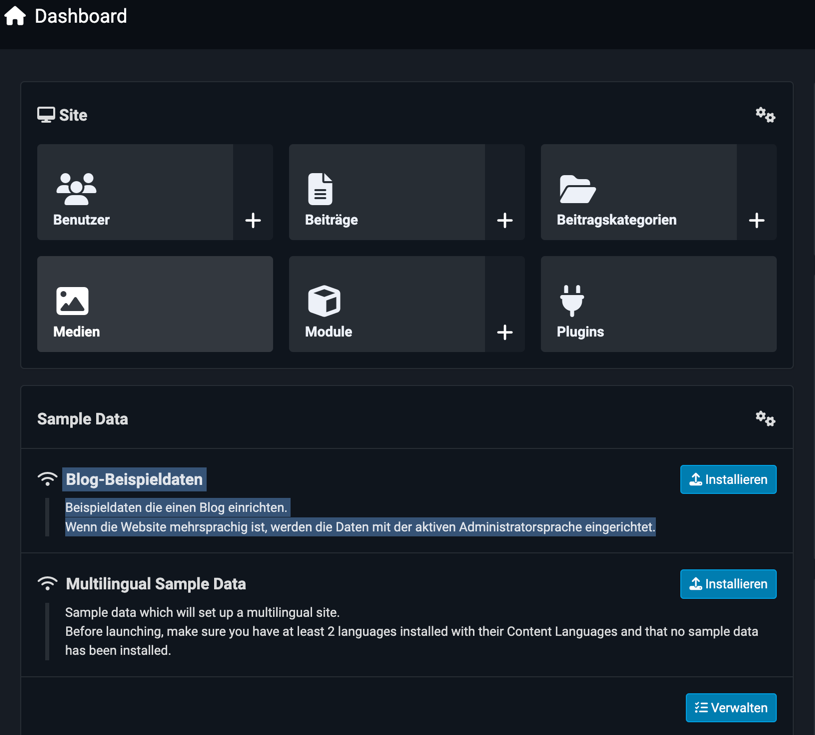
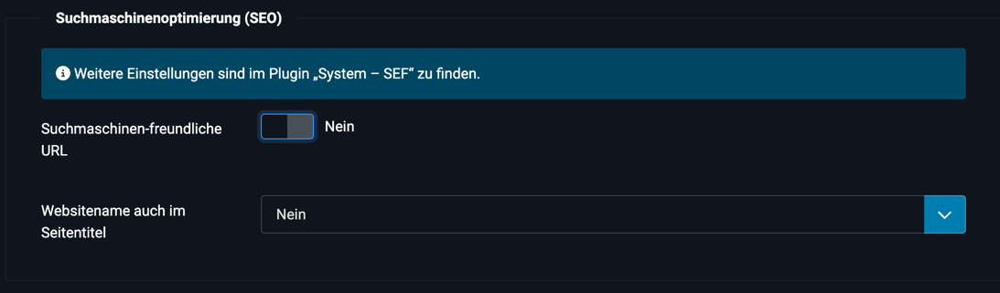
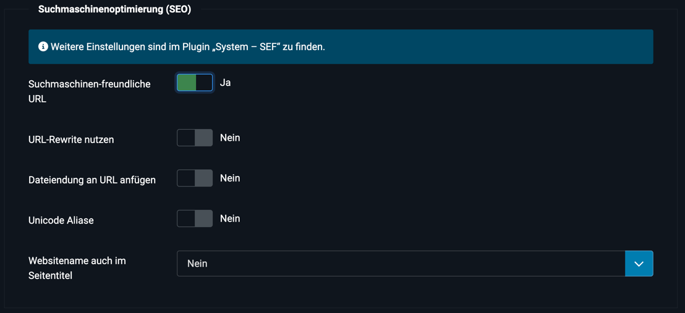
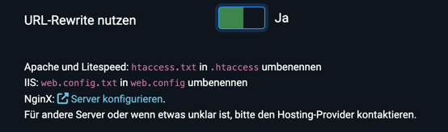
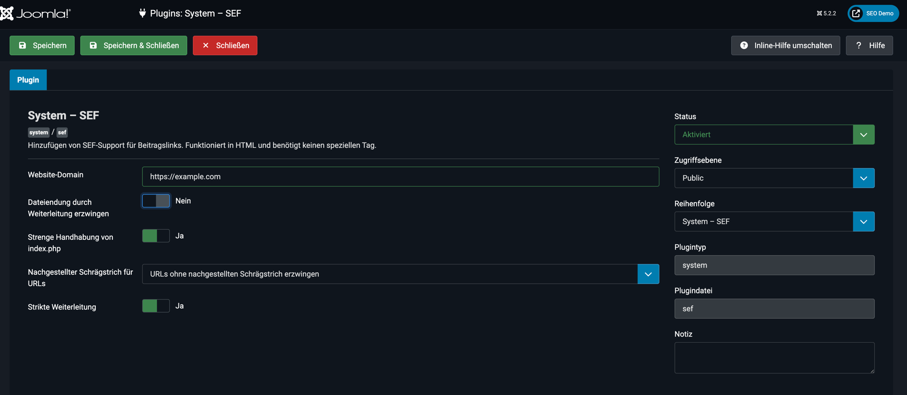
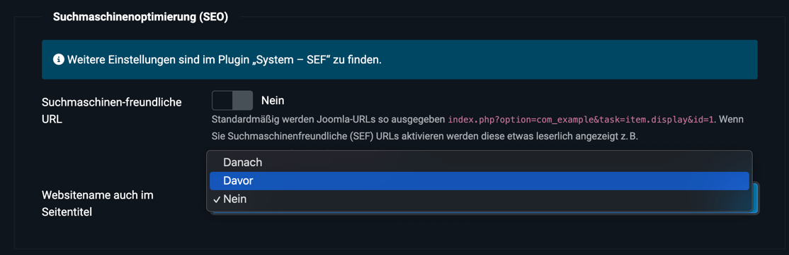
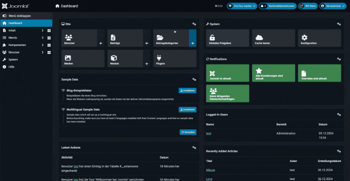
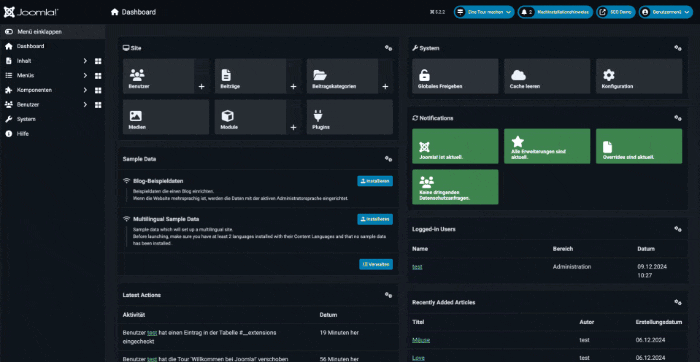

### **SEO-Grundkonfiguration in Joomla 5.2: Schritt für Schritt**

Die richtige URL-Struktur ist ein entscheidender Faktor für eine erfolgreiche SEO-Strategie. URLs sind oft das Erste, was Nutzer und Suchmaschinen sehen. Saubere und gut strukturierte URLs helfen, Inhalte besser zu verstehen und wirken sich positiv auf die Benutzerfreundlichkeit aus. In diesem Artikel zeige ich dir, wie du die URL-Struktur und SEO-Einstellungen in Joomla 5.2 optimierst, und erkläre die Vorteile jeder Einstellung im Detail.

Begleitend zu diesem Artikel gibt es ein [ **Video-Tutorial auf YouTube**](https://youtu.be/nr7r7ognC-w), in dem alle Schritte ausführlich erklärt werden:  

Falls du Fragen oder Anregungen hast, nutze gerne die Kommentarfunktion unter dem Video – ich freue mich, von dir zu hören!

---

### **1. Joomla-Installation und Demo-Daten (optional)**

Zunächst installieren wir Joomla. Lade die neueste Version von [joomla.org](https://downloads.joomla.org/) herunter. Alternativ kannst du den Download-Link über das Terminal abrufen:

```bash
wget https://downloads.joomla.org/cms/joomla5/5-2-2/Joomla_5-2-2-Stable-Full_Package.zip?format=zip
```

Entpacke die Datei anschließend:
```bash
unzip Joomla_5-2-2-Stable-Full_Package.zip?format=zip
```

Rufe die Installationsroutine im Browser auf, wähle Deutsch als Sprache und schließe die Installation ab. Danach installieren wir Demo-Daten über das SampleData Blog Plugin. Diese Inhalte erleichtern das Testen und Visualisieren der SEO-Einstellungen.



---

### **2. Reset und Überprüfung der URLs im Frontend**

Nach der Installation überprüfen wir die URL-Struktur im Frontend. Dafür deaktivieren wir alle Einstellungen. Standardmäßig sind die URLs lang und enthalten viele Parameter:

- **Standard URLs nach der Installation:**  
  `https://example.com/index.php/typography`

Wir deaktiveren die SEO-freundlichen URLs und das URL-Rewrite, um den ursprünglichen Zustand wiederherzustellen `System > Konfiguration > Site > SEO-freundliche URLs` auf `Nein`:



- **Beispiel ohne SEO-freundliche URLs:**    
  `https://example.com/index.php?option=com_content&view=article&id=11&catid=11&Itemid=107`

Wenn du dich fragst, warum die URL so lang und kryptisch aussieht, bist du nicht allein! Lass uns gemeinsam die Bestandteile dieser URL aufschlüsseln und verstehen, was sie bedeutet.

---

#### **Was bedeuten die einzelnen Teile dieser URL?**

1. **`https://example.com/`**  
   Das ist der Domainname deiner Website. In unserem Beispiel heißt die Website „example.com“.

2. **`index.php`**  
   Dieser Teil zeigt an, dass Joomla die Inhalte über ein zentral gesteuertes PHP-Skript ausliefert. Joomla ruft alle Inhalte über `index.php` auf, bevor sie angezeigt werden.

3. **`?option=com_content`**  
   Hier wird der Joomla-Komponente mitgeteilt, welche Art von Inhalt angezeigt werden soll. In diesem Fall zeigt `com_content` an, dass ein Artikel aus dem Joomla-Artikelmanager geladen wird.

4. **`&view=article`**  
   Das sagt Joomla, dass es sich um die Ansicht für einen einzelnen Artikel handelt. Es gibt auch andere Ansichten, wie zum Beispiel eine Kategorie-Ansicht (`view=category`).

5. **`&id=11`**  
   Das ist die ID des Artikels, den Joomla laden soll. Jede Seite, jeder Beitrag und jede Kategorie in Joomla hat eine eindeutige ID.

6. **`&catid=11`**  
   Das ist die ID der Kategorie, zu der der Artikel gehört. Dies hilft Joomla, die Hierarchie der Inhalte zu verstehen.

7. **`&Itemid=107`**  
   Das ist die ID des Menüpunktes, über den dieser Artikel aufgerufen wurde. Joomla nutzt diese Information, um das Design, die Modulzuweisungen und andere Einstellungen basierend auf dem Menüeintrag zu laden.

---

#### **Warum ist diese URL problematisch?**

So eine URL ist:
- **Schwer zu lesen:** Ein Nutzer kann nicht erkennen, worum es auf der Seite geht, bevor er darauf klickt.
- **Nicht benutzerfreundlich:** Lange und kryptische URLs wirken auf Besucher abschreckend.
- **Schlecht für SEO:** Suchmaschinen bevorzugen klare, kurze URLs, die relevante Schlüsselwörter enthalten.

---

### **3. URL-Manipulation und SEF-Plugin**

#### **3.1 SEO-freundliche URLs aktivieren**

Die Aktivierung der Option „Suchmaschinenfreundliche URLs“ unter `System > Konfiguration > Site` entfernt unnötige Parameter aus den URLs.


- **Beispiel ohne SEO-freundliche URLs:**  
  `https://example.com/index.php?option=com_content&view=article&id=11&catid=11&Itemid=107`
- **Beispiel mit SEO-freundlichen URLs:**  
  `https://example.com/index.php/typography`

**Vorteil:**  
Die URLs werden kürzer und lesbarer, was die Benutzerfreundlichkeit verbessert und Suchmaschinen hilft, den Inhalt besser zu indexieren.

---

#### **3.2 URL-Rewrite und .htaccess aktivieren**

Aktiviere „URL-Rewrite nutzen“ und benenne `htaccess.txt` in `.htaccess` um. Dadurch wird „index.php“ aus den URLs entfernt:



- **Vorher:**  
  `https://example.com/index.php/typography`
- **Nachher:**  
  `https://example.com/typography`

**Vorteil:**  
Die URLs sind jetzt sauber und einfacher für Nutzer und Suchmaschinen zu verstehen. Suchmaschinen werten kurze, klar strukturierte URLs als vertrauenswürdiger.

---

#### **3.3 Dateiendung an URL anfügen**

Mit dieser Option kannst du URLs mit `.html`-Endungen versehen:
- **Beispiel ohne Endung:**  
  `https://example.com/typography`
- **Beispiel mit Endung:**  
  `https://example.com/typography.html`

**Vorteil:**  
Das Hinzufügen von `.html` kann Nutzern vertrauter erscheinen, besonders wenn sie statische Webseiten gewohnt sind, bei denen Dateien direkt aufgerufen wurden (z. B. `index.html` oder `about.html`). Auch heute noch verbinden viele Nutzer diese Endungen mit klassischen, „festen“ Webseiten, was Vertrauen schafft und den Eindruck erweckt, die Seite sei langlebig und stabil.

---

#### **3.4 Unicode Aliase**

Die Einstellung „Unicode Aliase“ sorgt dafür, dass Sonderzeichen wie Umlaute oder Akzente in URLs korrekt dargestellt werden. Das betrifft sowohl die Alias-Namen von Beiträgen als auch die von Menüeinträgen.

- **Beispiel deaktiviert:**  
  `https://example.com/maeuse`  
  Hier werden Umlaute standardmäßig aufgelöst (z. B. „ä“ wird zu „ae“), was für ältere Browser und Systeme robuster ist.

- **Beispiel aktiviert:**  
  `https://example.com/mäuse`  
  Mit aktivierten Unicode Aliasen werden Sonderzeichen wie „ä“ oder „ß“ direkt in der URL angezeigt.

---

#### **Was passiert technisch?**

- **Alias für Beiträge:**  
  Wenn du einen Beitrag erstellst und dieser „Mäuse fangen“ heißt, wird der Alias (also der URL-Teil) automatisch generiert.
  - **Ohne Unicode Aliase:** `maeuse-fangen`
  - **Mit Unicode Aliase:** `mäuse-fangen`

- **Alias für Menüeinträge:**  
  Menüeinträge, die ebenfalls Titel mit Sonderzeichen haben, folgen demselben Muster. Aktivierte Unicode Aliase ermöglichen es, die Sonderzeichen direkt in der URL darzustellen.

---

#### **Warum ist das nicht immer sinnvoll?**

Die Unterstützung von Unicode-Zeichen in URLs ist nicht universell:
1. **Alte Browser und Systeme:**  
   Ältere Browser oder Systeme könnten Probleme haben, solche URLs korrekt darzustellen oder zu verarbeiten. Das betrifft vor allem Geräte oder Software, die keine UTF-8-Zeichen in URLs unterstützen.

2. **Klarheit und Konsistenz:**  
   URLs wie `maeuse` sind universell verständlich und funktionieren in jeder Umgebung. Sie sind robuster und vermeiden mögliche Kodierungsprobleme.

3. **SEO und Teilen der URLs:**  
   Unicode-Zeichen in URLs werden oft als `%`-Kodierungen dargestellt, wenn sie über soziale Medien oder per E-Mail geteilt werden. Zum Beispiel wird `mäuse` zu `m%C3%A4use`. Das sieht weniger benutzerfreundlich aus und kann Nutzer verwirren.

---

#### **Wann ist es sinnvoll, Unicode Aliase zu aktivieren?**

- Wenn deine Zielgruppe international ist und du sicherstellen möchtest, dass die URL genauso aussieht wie der Titel (z. B. für Marken oder spezielle Namen).
- Für moderne Browser und Systeme ist dies in der Regel kein Problem.

Für maximale Kompatibilität und Klarheit ist es jedoch oft besser, diese Option deaktiviert zu lassen und auf standardisierte Alias-Namen ohne Sonderzeichen zu setzen.

---

### **4. SEF-Plugin in Joomla 5.2**

#### **4.1 Website-Domain und Canonical Tag**

Das Hinzufügen einer Website-Domain im SEF-Plugin bewirkt, dass Joomla automatisch ein Canonical-Tag im Head-Bereich jeder Seite einfügt. Dieses Tag definiert die bevorzugte URL für die jeweilige Seite und signalisiert Suchmaschinen, dass es sich um die "kanonische" Version handelt.

- **Beispiel für Canonical Tag:**  
  `<link rel="canonical" href="https://example.com/typography" />`

**Vorteil:**  
Canonical-Tags verhindern, dass dieselbe Seite unter verschiedenen URL-Varianten (z. B. mit und ohne „www“ oder mit zusätzlichen Query-Parametern) indexiert wird. Suchmaschinen erkennen die bevorzugte URL und konsolidieren den SEO-Wert auf diese eine Version. Dies verbessert die Konsistenz und verhindert Ranking-Verluste durch doppelte Inhalte.

---

#### **4.2 Dateiendung durch Weiterleitung erzwingen**

Diese Einstellung sorgt dafür, dass URLs ohne Endung (z. B. `.html`) automatisch auf die Version mit der Endung weitergeleitet werden. Die Weiterleitung wird per 301-Status durchgeführt, wodurch Suchmaschinen die Ziel-URL als endgültig betrachten.

- **Beispiel:**
  - **Aufruf ohne Endung:** `https://example.com/typography`
  - **Weitergeleitete URL mit Endung:** `https://example.com/typography.html`

**Vorteil:**  
Die Weiterleitung garantiert, dass Suchmaschinen nur die gewählte URL-Variante indexieren. Dadurch wird verhindert, dass die Seite unter unterschiedlichen Varianten (mit und ohne `.html`) indexiert wird. Ab Joomla 6.0 ist diese Funktion standardmäßig aktiv.

---

#### **4.3 Strenge Handhabung von index.php**

Mit dieser Einstellung wird „index.php“ automatisch aus den URLs entfernt, wenn „URL-Rewrite nutzen“ aktiviert ist. Jede URL, die „index.php“ enthält, wird per 301-Weiterleitung auf die saubere Version ohne „index.php“ umgeleitet.

- **Beispiel:**
  - **Vorher:** `https://example.com/index.php/typography`
  - **Nachher:** `https://example.com/typography`

**Vorteil:**  
Diese Funktion stellt sicher, dass die Seite nur über eine einheitliche URL aufgerufen werden kann. Varianten mit „index.php“ werden zuverlässig auf die saubere URL weitergeleitet. Das verbessert nicht nur die SEO, sondern sorgt auch für ein einheitliches Nutzererlebnis.

---

#### **4.4 Nachgestellter Schrägstrich für URLs**

Mit dieser Einstellung kannst du erzwingen, dass URLs entweder immer mit oder ohne nachgestellten Schrägstrich dargestellt werden. Joomla sorgt per 301-Weiterleitung dafür, dass nur die gewählte Variante funktioniert.

- **Beispiel mit Schrägstrich:**  
  `https://example.com/typography/`
- **Beispiel ohne Schrägstrich:**  
  `https://example.com/typography`

**Vorteil:**  
Dank dieser Einstellung gibt es keine doppelten URLs mit und ohne Schrägstrich. Nutzer und Suchmaschinen werden konsequent auf die bevorzugte Variante geleitet, was die Indexierung und den SEO-Wert der Seite verbessert.

---

#### **4.5 Strikte Weiterleitung**

Die Funktion „Strikte Weiterleitung“ sorgt dafür, dass URLs mit langen Query-Parametern (wie `index.php?option=com_content&view=article&id=11&catid=11&Itemid=107`) automatisch auf eine saubere, lesbare Version weitergeleitet werden.

- **Beispiel:**
  - **Vorher:** `https://example.com/index.php?option=com_content&view=article&id=11&catid=11&Itemid=107`
  - **Nachher:** `https://example.com/typography`

**Vorteil:**  
Diese Einstellung sorgt dafür, dass jede Seite nur über eine einzige, einheitliche URL aufgerufen werden kann. Das verhindert, dass mehrere Varianten derselben Seite (mit und ohne Query-Parameter) in den Suchmaschinen auftauchen. So wird der gesamte SEO-Wert der Seite auf die eine saubere URL gebündelt. Dies reduziert Verwirrung für Suchmaschinen und Nutzer und macht die Website insgesamt übersichtlicher.

---

### **Einheitliche URL-Aufrufe dank des SEF-Plugins**

Das SEF-Plugin in Joomla 5.2 stellt sicher, dass jede Seite deiner Website nur über eine einheitliche URL aufgerufen werden kann. Varianten wie:
- `https://example.com/index.php/typography`
- `https://example.com/typography`
- `https://example.com/typography.html`

werden per Weiterleitungen auf die bevorzugte Variante gelenkt. Dies verhindert doppelte Inhalte und stellt sicher, dass Suchmaschinen den gesamten SEO-Wert einer Seite nicht auf mehrere URLs verteilen. Auch Nutzer profitieren, da sie immer auf der „richtigen“ Version der Seite landen, egal über welche URL sie kommen.

---

### **5. SEO-Einstellungen in Joomla**

#### **5.1 Website-Name auch im Seitentitel**



Joomla bietet die Möglichkeit, den Namen der Website automatisch im Titel einer Seite anzuzeigen. Dies kann entweder vor oder nach dem individuellen Seitentitel erfolgen, oder du kannst den Website-Namen komplett aus dem Titel entfernen.

- **Beispiele:**
  - **Ohne Website-Name:** `Typography`
  - **Website-Name davor:** `SEO Demo - Typography`
  - **Website-Name danach:** `Typography - SEO Demo`

**Vorteil:**  
Der Website-Name im Seitentitel kann sinnvoll sein, um die Marke zu stärken und die Wiedererkennbarkeit in den Suchergebnissen zu erhöhen. In den meisten Fällen ist es jedoch besser, dies gezielt für wichtige Seiten einzusetzen, anstatt es global zu aktivieren.

---

#### **5.2 Meta-Beschreibung**


Die globale Meta-Beschreibung in den Joomla-Einstellungen sollte leer bleiben, da sie ansonsten auf jeder Seite angezeigt wird – auch dort, wo sie nicht relevant ist.

- **Beispiel ohne individuelle Meta-Beschreibung:**  
  `Meta Description: 'Willkommen auf unserer Website!'`

**Vorteil:**  
Individuelle Meta-Beschreibungen auf Beitrags- oder Menüebene helfen Suchmaschinen, den Inhalt jeder Seite besser zu verstehen. Außerdem erhöhen sie die Klickrate, wenn sie gezielt auf die Seite abgestimmt sind.

---

#### **5.3 Robots Globale Einstellung**



Die Robots-Einstellung in Joomla gibt dir die Möglichkeit, Anweisungen für Suchmaschinen festzulegen. Diese Einstellungen findest du unter `System > Konfiguration > Site > Metadaten`. Es gibt mehrere Optionen:

- **`index, follow` (Standard):**  
  Die Seite wird von Suchmaschinen indexiert, und Links auf der Seite werden verfolgt. Diese Einstellung ist optimal für alle Seiten, die in den Suchergebnissen erscheinen sollen.

- **`noindex, follow`:**  
  Die Seite wird nicht indexiert, aber Links auf der Seite werden verfolgt. Das ist sinnvoll für Seiten, die du von den Suchergebnissen ausschließen möchtest, z. B. den Blog-Bereich oder interne Suchseiten.

- **`index, nofollow`:**  
  Die Seite wird indexiert, aber Links auf der Seite werden nicht verfolgt. Diese Einstellung wird selten verwendet, da sie den SEO-Wert der Seite reduziert.

- **`noindex, nofollow`:**  
  Weder die Seite noch die Links auf ihr werden von Suchmaschinen berücksichtigt. Diese Einstellung eignet sich für Seiten, die absolut nicht in den Suchergebnissen erscheinen sollen, wie z. B. Entwicklungs- oder Testseiten.

**Vorteil:**  
Mit der richtigen Konfiguration kannst du gezielt steuern, welche Seiten in den Suchergebnissen auftauchen und welche nicht. Das hilft dabei, irrelevante oder doppelte Inhalte aus den Suchmaschinen fernzuhalten und den SEO-Fokus auf die wichtigen Seiten zu legen.

---

#### **5.4 Joomla-Version anzeigen**

**Standard: Verbergen** 

Ist die Option aktiviert, wird die Joomla-Version im Head-Bereich der Seite angezeigt. Das kann z. B. so aussehen: 
`<meta name="generator" content="Joomla! - Open Source Content Management - Version 5.2.2">`

**Warum Verbergen?**  
Hacker könnten diese Information nutzen, um gezielt Schwachstellen in älteren Versionen anzugreifen. Es ist daher empfehlenswert, diese Option immer auszuschalten. 
*Ja es gibt auch andere Möglichkeiten*

---

#### **5.5 Meta-Titel und -Beschreibung vererben**

Meta-Titel und -Beschreibungen können in Joomla automatisch vererbt werden. Wenn ein Menüpunkt z. B. den Titel „Über uns“ hat, wird dieser Titel auch für den verknüpften Beitrag übernommen, sofern der Beitrag keine eigene Beschreibung oder keinen eigenen Titel hat.

- **Beispiel:**
  - Menü-Titel: `Über uns`
  - Beitrag ohne eigenen Meta-Titel: Vererbt den Titel „Über uns“

**Vorteil:**  
Diese Vererbung spart Zeit bei der Erstellung von Beiträgen. Dennoch ist es wichtig, für wichtige Seiten individuelle Meta-Daten zu setzen, um die Inhalte besser hervorzuheben.

---

Mit diesen SEO-Einstellungen kannst du sicherstellen, dass deine Joomla-Website sowohl benutzerfreundlich als auch für Suchmaschinen optimiert ist. Jede Einstellung trägt dazu bei, die Sichtbarkeit und die Nutzererfahrung zu verbessern, ohne unnötige Risiken einzugehen.

---

### **6. Fazit**

Gemeinsam haben wir die URL-Struktur optimiert, die neuen Funktionen des SEF-Plugins genutzt und Meta-Daten individuell angepasst. Mit diesen Einstellungen ist deine Joomla-Website bestens für Suchmaschinen vorbereitet und bietet eine bessere Nutzererfahrung.

Begleitend zu diesem Artikel findest du ein **Schritt-für-Schritt-Video** auf YouTube:  
[**Platzhalter für YouTube-Link**]

Ich freue mich über deine Fragen und Anregungen – nutze gerne die Kommentarfunktion im Video, und ich helfe dir weiter!

---

Soll ich noch weitere Details hinzufügen oder etwas anpassen? 😊